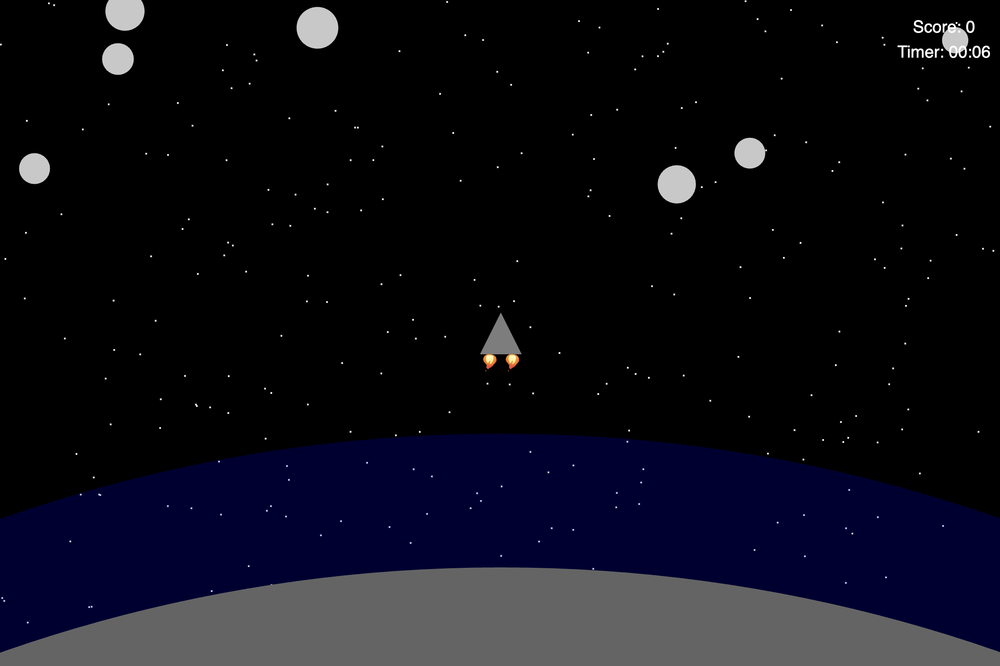

# Asteroid Game

## About

This application is a shooting game created using the p5.js library. The aim of the game is to shoot as many asteroids as possible before an asteroid or the spaceship crashes into the earth. The atmosphere around the earth contains gravity, causing the spaceship to be pulled towards the earth if it enters the atmosphere. Here are the controls to play the game:

- Arrow keys: To move the spaceship.

- Space bar: To shoot bullets.